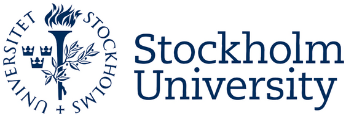

<table class="center" style="width: 100%; border-collapse: collapse; border-style: hidden; height: 36px;" border="1">
<tbody>
<tr style="height: 18px;">
	<td style="width: 70%; height: 18px;"><h1>Rui Benfeitas, PhD </h1>
		<h3>Multi-omics Integration and Systems Biology</h3>
		
Senior bioinformatician & Vice Training Coordinator
 
		
		
		
		
		
		
		 
		
		
		
	</td>
	<td style="width: 30%; height: 18px;"></td>
</tr>
</tbody>
</table>

<!-- Summary -->
<table class="center" style="width: 100%; border-collapse: collapse; border-style: hidden; height: 36px;" border="1">
<tbody>
<tr style="height: 18px;" class="tr.justify">
	
My research focuses in employing systems biology, network analysis and machine learning techniques
	for integration of high throughput data for disease characterization, patient stratification, connecting risk factors with molecular features, and computational prediction of therapeutic targets. I develop new algorithms for subgroup identification and personalized medicine characterizations in cancer, metabolic and infectious diseases, by combining transcriptomic, proteomic, metabolomic, and epigenomic data.

	
I am involved in bioinformatics training as course leader and Vice-coordinator for Training. I coordinate about 20 courses per year, for national and international bioinformatic events driven by <a href='nbsi.se'>NBIS</a>. I am also course leader for a course in <a href='https://uppsala.instructure.com/courses/52162'>Omics Integration and Systems Biology</a>, a course that we have taught several times in the past both <a href='https://uppsala.instructure.com/courses/52162'>nationally and internationally.</a> I regularly <a href="./pages/teaching.html">contribute to other courses</a> with ad-hoc lessons.

	
I contribute as Scientific Advisor to <a href="www.metabolicatlas.org">Metabolic Atlas</a>, and am part of the <a href="https://elixir-europe.org/focus-groups/systems-biology">Elixir Systems Biology Focus Group</a>.

</tr>

<!-- NEWS -->
<tr style="height: 18px;" >
	 
<strong>News:</strong>

		
- 22/07/2021 - I organized and taught a short tutorial in omics integration and systems biology at the <a href="https://nbisweden.github.io/workshop_omicsint_ISMBECCB/"> ISMB / ECCB 2021</a>.

		
- 11/05/2021 - Our work in CVD that was previously in <a href="https://www.biorxiv.org/content/10.1101/2020.10.28.358556v2">biorxiv</a> is now <a href="https://elifesciences.org/articles/66921">published in eLife</a>. See also the <a href="https://elifesciences.org/articles/69863">highlight</a>.

		
- 04/05/2021 - We studied the lipidomic and metabolomic relationships displayed by HIV patients undergoing long-term retroviral treatment in <a href="https://www.medrxiv.org/content/10.1101/2021.05.04.21256640v1">a new preprint.</a> 

		
- 30/04/2021 - New <a href="https://www.medrxiv.org/content/10.1101/2021.04.01.21254778v1">pre-print out</a> for our work in metabolomic characterization in HIV of the COCOMO cohort.

		
- 02/03/2021 - New <a href="https://www.biorxiv.org/content/10.1101/2021.02.24.432759v1.full">pre-print out</a> for our work in characterizing disrupted metabolism in host cells infected with SARS-CoV-2.

	</tr>
<tr style="height: 18px;" >
	

    
<strong>Past news</strong>

    
-PLACEHOLDER

</tr>
</tbody>
</table>