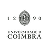

## Past positions
 **2019 – current:** Senior Bioinformatician  
&nbsp;&nbsp;[National Bioinformatics Infrastructure Sweden (NBIS)](https://www.nbis.se/about/staff/rui-benfeitas/)  
&nbsp;&nbsp;[SciLifeLab](www.scilifelab.se) | [DBB Stockholm University](https://www.dbb.su.se/)  
  
 **2016 – 2018:** Postdoctoral researcher  
&nbsp;&nbsp;[Human Protein Atlas](https://www.proteinatlas.org/) | [Sysmedicine](sysmedicine.com)  
&nbsp;&nbsp;[SciLifeLab](www.scilifelab.se) | [KTH – Royal Institute of Technology](kth.se)  

## Education
 **2016:**  PhD Computational Biology, [University of Coimbra, Portugal](https://www.uc.pt/fctuc)  
&nbsp;&nbsp;[Center for Neuroscience and Cell Biology](http://www.cnbc.pt/)  
&nbsp;&nbsp;[Computational and Systems Biology Group](http://www.cnbc.pt/research/department_group_show.asp?iddep=1947&idgrp=1310)  
&nbsp;&nbsp;*Thesis: Active and passive defenses against oxidative stress: a computational study*    

 **2014:**  Visiting PhD, [University of Lleida, Spain](https://www.irblleida.org/en/research/14/systems-biology-and-statistical-methods-for-biomedical-research)  

 **2011:** MSc Biochemistry, [University of Lisbon, Portugal](https://ciencias.ulisboa.pt/en)  
&nbsp;&nbsp;*Thesis: The physiological role of peroxiredoxin 2 in human erythrocytes. A kinetic analysis.*  

 **2008:** BSc Biology, [University of Coimbra, Portugal](https://www.uc.pt/fctuc)  

## Contact
rui.benfeitas [at] scilifelab.se